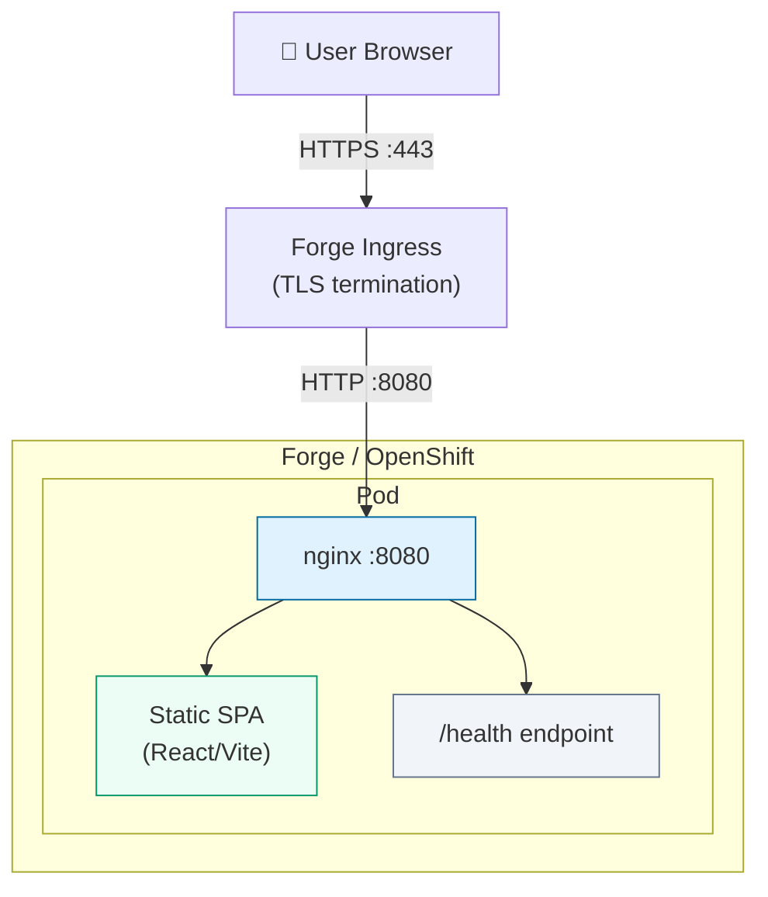
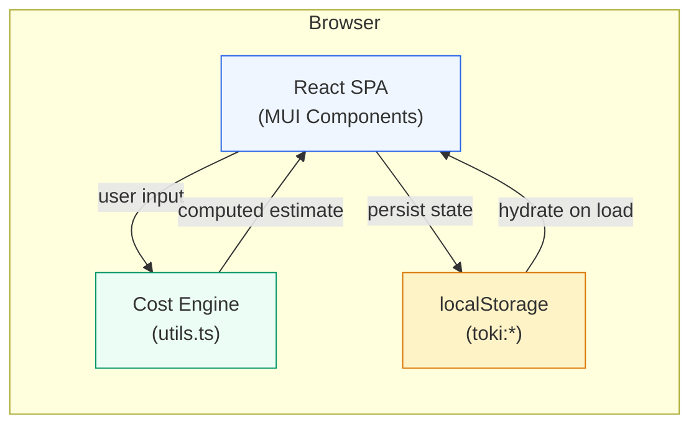
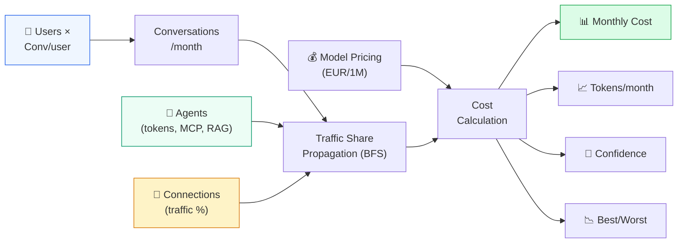
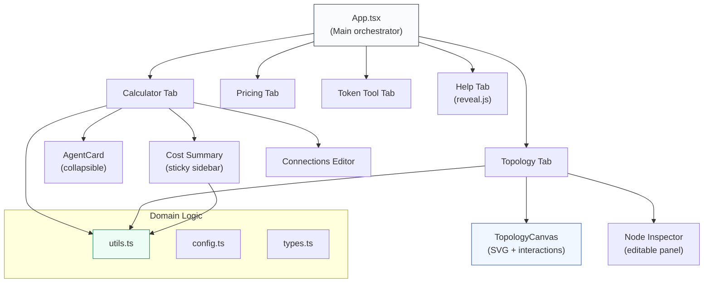
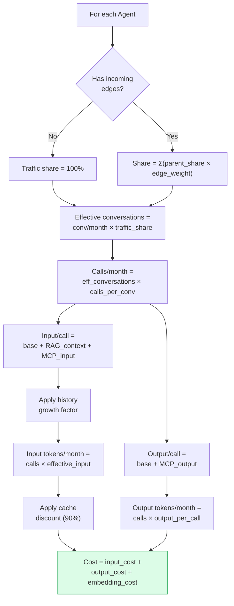
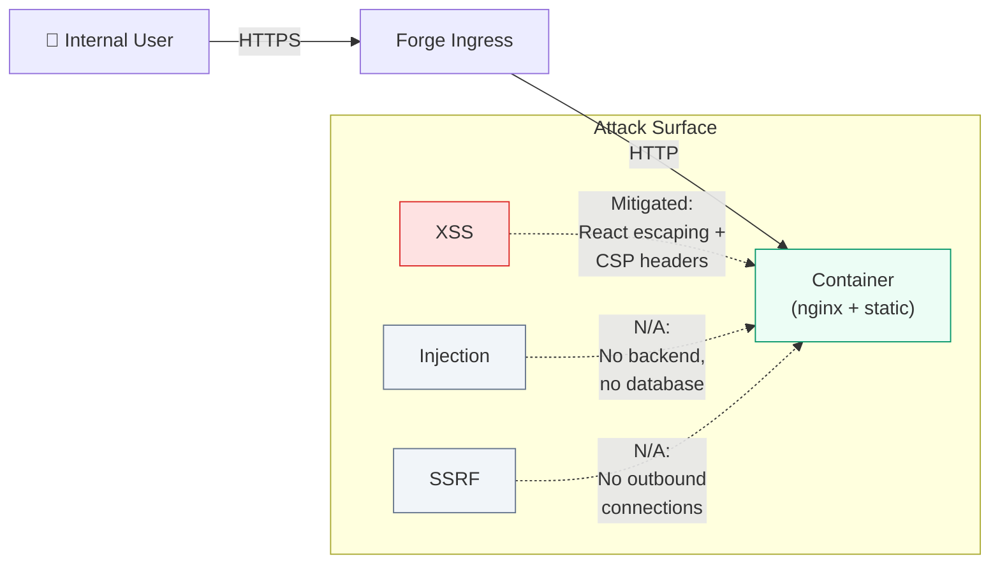
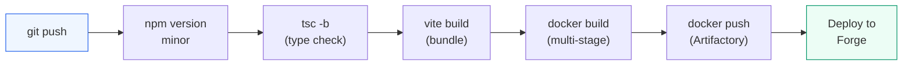
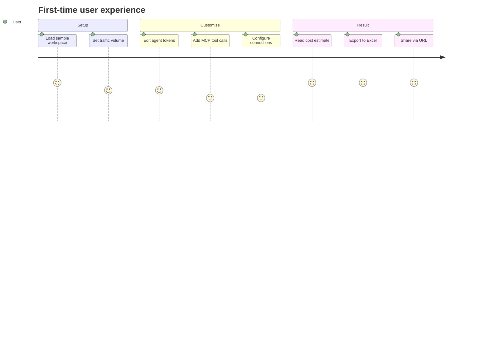

# Toki — High-Level Design (HLD)

**Version:** 2.0  
**Author:** Vincenzo MARAFIOTI  
**Date:** June 2026  
**Status:** Ready for Forge onboarding review

---

## 1. Purpose

Toki is an internal web application that estimates the monthly token consumption and cost of multi-agent LLM architectures. It enables engineering teams and FinOps stakeholders to model agentic AI systems and produce defensible budget estimates before development begins.

---

## 2. Problem Statement

Teams deploying agentic AI systems (orchestrators, specialized agents, RAG pipelines, MCP tool-calling agents) have no standard way to estimate runtime token costs. This leads to:

- Budget overruns discovered only after production deployment
- Inability to compare architecture alternatives on cost
- No FinOps governance on LLM spend
- Manual spreadsheets that break when architectures change

---

## 3. Solution Overview

Toki provides a real-time cost calculator with:

- Multi-agent topology modeling (agents, connections, traffic routing)
- Per-agent token parameter configuration (input/output tokens, MCP tool calls, RAG retrieval)
- Automatic cost computation using current model pricing (OpenAI, Anthropic)
- Confidence scoring and best/worst case cost ranges
- Export capabilities (JSON, CSV, Excel) and URL-based sharing

---

## 4. Architecture

### 4.1 Deployment Architecture

### 4.2 Application Architecture

### 4.3 Data Flow

### 4.4 Component Structure

### 4.5 Key Design Decisions

| Decision | Rationale |
|----------|-----------|
| Static SPA (no backend) | Zero operational complexity, no database, no secrets management |
| localStorage persistence | No server-side state needed; workspace is client-local |
| URL sharing via base64 | Share workspaces without a backend/database |
| nginx on port 8080 | OpenShift SCC compliance (non-root, non-privileged port) |
| Multi-stage Docker build | Small production image (~50MB), fast builds |

---

## 5. Technology Stack

| Layer | Technology | Version |
|-------|-----------|---------|
| Language | TypeScript | 5.5+ |
| Framework | React | 18.3 |
| UI Library | MUI (Material UI) | 9.0 |
| Build Tool | Vite | 5.4 |
| Testing | Vitest + Testing Library | 2.1 |
| Presentation | reveal.js | 5.1 |
| Web Server | nginx | Latest (RHEL package) |
| Container | Docker (multi-stage) | — |
| Platform | OpenShift (Forge) | — |
| Base Image | Amadeus RHEL (`acs/rhel-init`) | — |

---

## 6. Cost Engine Logic

---

## 7. Security Assessment

| Aspect | Assessment |
|--------|-----------|
| Authentication | Not required (internal tool, no sensitive data) |
| Authorization | Not required (no multi-tenancy) |
| Data at rest | localStorage only (browser-local, no server storage) |
| Data in transit | HTTPS (Forge terminates TLS at ingress) |
| PII handling | **None** — no personal data processed or stored |
| Secrets | None — no API keys, no database credentials |
| Dependencies | React, MUI, Vite (well-maintained, audited) |
| Container | Non-root user (UID 1000), read-only filesystem, restricted SCC |

### 7.1 Threat Model

---

## 8. Non-Functional Requirements

| Requirement | Target | Implementation |
|-------------|--------|---------------|
| Availability | 99.5% | Static serving via nginx (no application logic that can crash) |
| Performance | < 1s page load | Vite optimized bundle, gzip compression, 1-year asset caching |
| Scalability | N/A | Client-side computation, no server load |
| Disaster Recovery | N/A | Stateless; redeploy from Git at any time |
| Monitoring | Basic | `/health` endpoint for OpenShift probes |
| Backup | N/A | No server-side data to back up |

---

## 9. Resource Requirements

| Resource | Request | Limit |
|----------|---------|-------|
| CPU | 50m | 200m |
| Memory | 64Mi | 128Mi |
| Storage | None (read-only filesystem) | — |
| Persistent Volume | Not required | — |
| Database | Not required | — |

---

## 10. External Connectivity

| Direction | Target | Purpose | Required |
|-----------|--------|---------|----------|
| Inbound | Users (browser) | Serve the SPA | Yes |
| Outbound | None | — | **No** |

**Note:** The application runs entirely in the browser. LLM pricing data is bundled at build time. No runtime external connectivity is needed from the server.

---

## 11. Deployment

### 11.1 CI/CD Pipeline

### 11.2 Docker Image

- **Base:** `docker-release.nce.dockerhub.rnd.amadeus.net/acs/rhel-init`
- **Build stage:** Node 20 Alpine (discarded after build)
- **Runtime:** nginx serving static files
- **Port:** 8080
- **User:** app (UID 1000, non-root)
- **Health:** `GET /health` → `{"status":"ok"}`

### 11.3 Rollback

Redeploy previous Docker image tag. No data migration needed (stateless).

---

## 12. Maintenance

| Activity | Frequency | Owner |
|----------|-----------|-------|
| Dependency updates | Monthly | Tool owner |
| Model pricing updates | As providers change | Tool owner |
| Security patching (base image) | Per Amadeus schedule | ACS team + Tool owner |
| Feature development | As needed | Tool owner |

---

## 13. User Journey

---

## 14. Future Considerations

- Integration with actual API usage logs for estimate calibration
- Per-model cache discount rates (50% OpenAI, 90% Anthropic)
- "What-if" comparison mode (change one parameter, see cost delta)
- Team workspaces (shared via backend, if demand justifies)
- AUDS integration for SSO (if required by policy)

---

## 15. Contacts

| Role | Contact |
|------|---------|
| Tool Owner | Vincenzo MARAFIOTI |
| Forge Support | DG-NCE-Forge-Support@amadeus.com |

---

## Appendix A: Forge Onboarding Configuration

| Field | Value |
|-------|-------|
| Tool name | `toki` |
| Domain | `toki.forge.amadeus.net` |
| Description | Token Cost Calculator for Agentic AI Systems |
| Type | `office` |
| Container port | `8080` |
| Personal data | None |
| Main technologies | TypeScript, React, Vite, nginx |
| Source repository | Corporate Git (Bitbucket/GitHub) |
| Persistent volume | Not required |
| Database | Not required |
| External connectivity | Not required |
